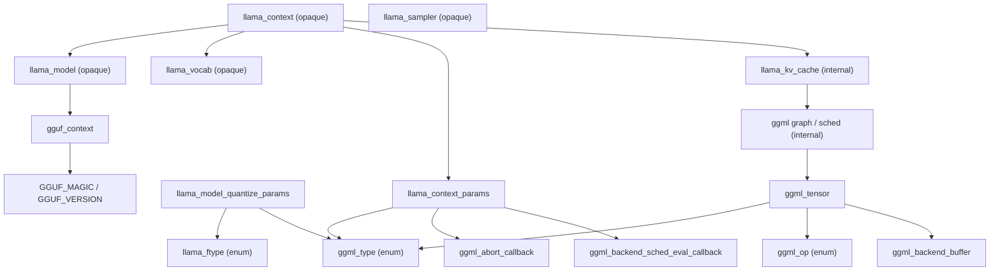
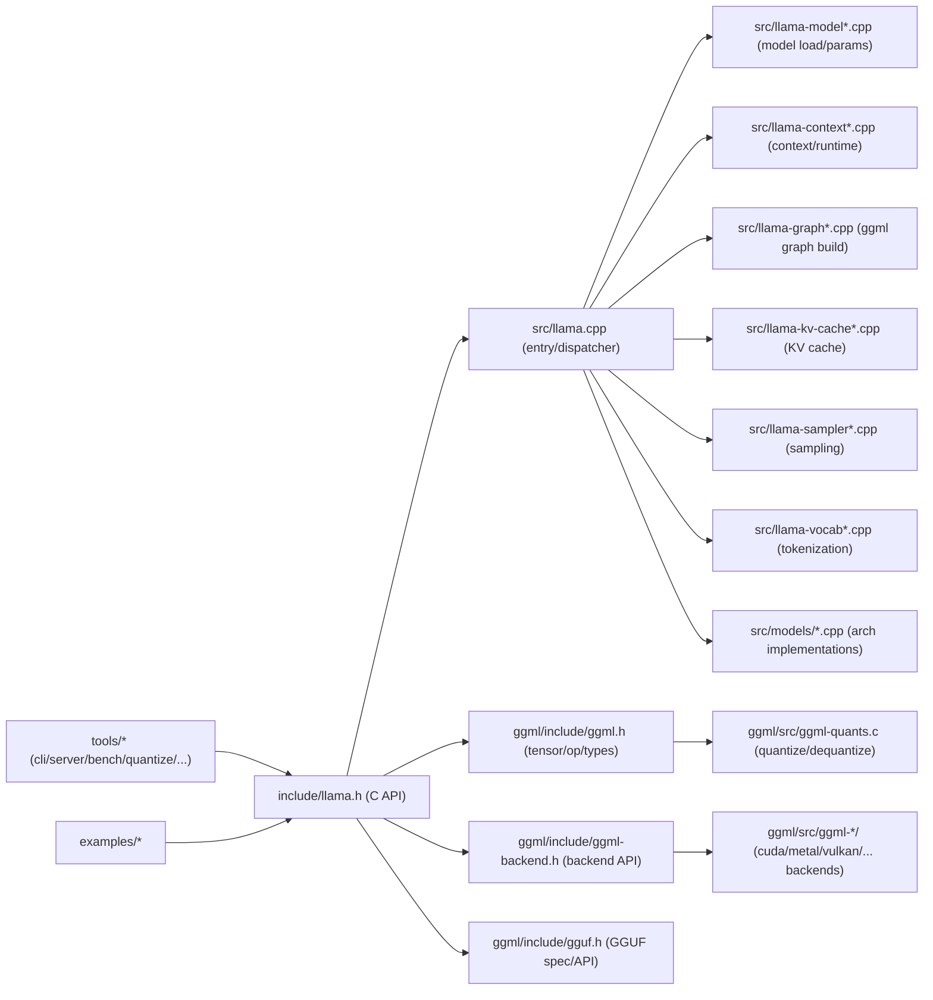
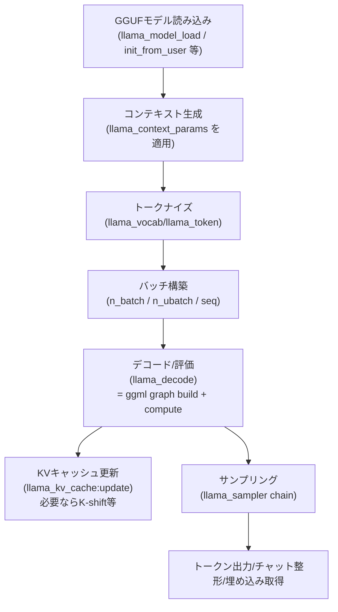

# 以下の調査ノートとrubber duckとあなた自身が調査していくことで、llama.cppとllama-rsを比較して、llama-rsに現在欠けている機能を余さず列挙したチェック表(カバレッジ表)を作成することが期待されます。また、benches,tests,examplesも全て対応表を作って、まだ実装されていないものがなんなのかをきちんと把握して作業に取り組めるようにdocsを更新しなさい。ggml-rsについても、C APIで可能なことがRustらしい(rustのskillsに詳しいことは書いてある、type state patternやADT、Traitやジェネリクスなどを積極的に使う)書き方でパフォーマンスもほとんど低下せずに、全て実施できることができるかどうかを調査しなさい。こちらもtests,benches,examplesのカバレッジを確認して、ggmlで実装されている機能がggml-rsのどこまで実装されているのかを把握し、ggml-rsに足りない機能を洗い出して、優先順位をつけて実装に取り組めるようにdocsを更新しなさい。ここら辺は忘れられるものがないように本当に全部1対1になるように書きなさい。また、llama.cppの実装の仕方も参考にして、Qwen3.5などの特定のモデルのみに特化した書き方が必要(llama.cppもそうなっている)ならば、ちゃんと汎用的に使える物とはちゃんと分けて、並行して別モデルも実装していけるような構造にすることもしなさい。さらに、llama.cppの実装の仕方を参考にして、モデルのロードや推論の際に、モデルの構造や量子化方式などを柔軟に扱えるような設計にすることも検討しなさい。これらの調査結果をもとに、ggml-rsのドキュメントを更新し、実装に取り組む際のガイドラインを明確にすることが期待されます。testsやbenchesで必要なら、pythonのskillの読み込みもした上で、具体的なモデルをとってくることも検討しなさい。この一行のポリシーについては、ちゃんとこのタスクが終わるまでは忘れないように、indexを貼るか書き込むかしてcompactの後にもちゃんと自動的に参照されるようにしなさい。また、以前の1つのworklogに固執しすぎることがないように、適宜積極的にdocsは更新していきなさい

# llama.cpp リポジトリ深掘り調査レポート

## エグゼクティブサマリー

本レポートは、entity["organization","ggml-org","github org"] が公開する entity["company","GitHub","code hosting platform"] リポジトリ「llama.cpp」（master ブランチ）を、2026-04-14（Asia/Tokyo）時点で、一次情報（リポジトリ内のソース、README、docs、tools、Issues/PR/Discussions）を中心に調査したものである。citeturn43search4turn52view1

調査の中心結論は次のとおり。第一に、llama.cpp の「モデル形式」は、推論時に扱う標準フォーマットとして **GGUF**（`GGUF_MAGIC` / `GGUF_VERSION` が定義される）を中核に据え、トークナイザ・ハイパーパラメータ・テンソル群をまとめて読み込む設計である。citeturn43search7turn32view3 さらにセッション/状態保存用のマジック（`GGSN`/`GGSQ`）が C API ヘッダに定義され、推論ランタイムの状態をファイルとして持ち運ぶ前提が明確である。citeturn28view0turn32view3

第二に、テンソル表現・演算・バックエンド抽象化は **ggml** が担う。`struct ggml_tensor` が「型 `ggml_type`、形状 `ne[]`、ストライド `nb[]`、演算種別 `ggml_op`、入力 `src[]`、ビュー `view_src/view_offs`、データ `data`、バックエンドバッファ `buffer`」などを保持し、計算グラフは `ggml_op` 列挙と `ggml_*` API 群で構築される。citeturn24view2turn40view2 RoPE（回転位置埋め込み）の“方式”は ggml 側で **マクロ定数**（`GGML_ROPE_TYPE_*`）として定義され、llama 側の `enum llama_rope_type` がそれに追従（`LLAMA_ROPE_TYPE_* = GGML_ROPE_TYPE_*`）する。citeturn39view3turn28view0

第三に、アーキテクチャ（「モデルタイプ」＝ネットワーク実装の系統）は `src/models/` に分割実装され、`llama.cpp`（LLaMA 系の中核）だけでなく、Qwen/DeepSeek/Gemma/RWKV/Mamba 系、各種 MoE など多数の実装ファイルが並ぶ（例：`qwen3*.cpp`、`deepseek*.cpp`、`gemma*.cpp`、`rwkv6*.cpp`、`mamba*.cpp` 等）。citeturn54view0turn55view0turn56view0turn55view1turn55view2

第四に、量子化は「(a) on-disk のデータ型（GGUF/ggml_type/llama_ftype）」「(b) ggml の量子化ブロックと参照実装（例：`quantize_row_q4_0_ref` / `quantize_row_q8_0_ref`）」「(c) 推論バックエンド（CPU/CUDA/Metal/Vulkan…）の演算対応表」の三層で語るのが最も正確である。citeturn28view0turn24view2turn56view3turn56view4turn23search4turn52view1

最後に、既知の機能上の注意点として、長文コンテキスト（RoPE/YaRN 等）に関する「ドキュメント不足」「サーバ側のコンテキスト上限判定」「モデル変換側のパラメータ反映不足」などが継続的に議論されているほか、バックエンド固有の未対応 op、RPC/バックエンド周りの不具合（例：OpenVINO での特定モデルロード失敗、RPC サーバのメモリ問題）など、運用に影響し得る論点が複数存在する。citeturn17search10turn17search5turn17search3turn23search8turn42search6turn23search14turn23search2

---

## サポートされるモデル形式とモデルタイプ

llama.cpp の「サポート形式」は、概ね次の軸で整理する必要がある：（1）**コンテナ/ファイル形式**（推論ロード対象）、（2）**テンソルのデータ型・量子化方式**、（3）**ネットワークアーキテクチャ（モデルタイプ）**、（4）**ランタイム状態の保存形式**。この 4 軸が混同されると「ロードは成功するが推論が壊れる」「変換はできたがバックエンドが op 未対応」等の原因切り分けが困難になる。citeturn43search7turn28view0turn24view2turn23search4turn52view1

### モデルコンテナ/ファイル形式

| 区分 | 形式/識別子 | 目的 | 技術的特徴（一次情報ベース） |
|---|---|---|---|
| 推論モデルの標準コンテナ | **GGUF** | 1ファイル（または分割）でモデルメタデータとテンソルを保持し推論に供する | `gguf.h` に `GGUF_MAGIC "GGUF"` と `GGUF_VERSION 3` が定義される（= 少なくとも v3 が前提）。citeturn43search7 |
| 推論状態保存 | **Session / State**（`GGSN`/`GGSQ`） | 推論ランタイムの状態（セッション・系列状態）をファイル化 | `include/llama.h` に `LLAMA_FILE_MAGIC_GGSN`（`'ggsn'`）・`LLAMA_FILE_MAGIC_GGSQ`（`'ggsq'`）と、`LLAMA_SESSION_VERSION`/`LLAMA_STATE_SEQ_VERSION` が定義される。citeturn28view0turn32view3 |
| （関連）拡張/派生ファイル | `GGLA` | マジック `'ggla'` が定義（用途はファイル種別の一つとして扱われる） | `LLAMA_FILE_MAGIC_GGLA` が C API ヘッダに定義される（具体的な運用上の意味は本調査範囲では追加特定できず、**未特定**）。citeturn28view0 |

**注（未特定）**：上表は「ヘッダに識別子として明確に現れる」形式に限っている。GGUF 以前の旧来形式（例：旧 ggml bin）については、本リポジトリには “legacy conversion” を示唆するスクリプトが存在するが（`examples/convert_legacy_llama.py`）、推論ロード可否・互換性の公式整理はここでは横断的に確定できない。citeturn50view0

### モデルタイプ（アーキテクチャ実装）の列挙

llama.cpp はアーキテクチャ実装を `src/models/` に分割しており、当該ディレクトリに存在するファイル名が「実装されているモデルタイプの一次的インデックス」として機能する。citeturn54view0turn55view0turn56view0turn55view1turn55view2

以下は `src/models/` に列挙されている主要ファイル（＝モデルタイプ実装）である（ファイル名は一次情報どおり、並びは原則ディレクトリ表示順）：  
`afmoe.cpp`, `apertus.cpp`, `arcee.cpp`, `arctic.cpp`, `arwkv7.cpp`, `baichuan.cpp`, `bailingmoe.cpp`, `bailingmoe2.cpp`, `bert.cpp`, `bitnet.cpp`, `bloom.cpp`, `chameleon.cpp`, `chatglm.cpp`, `codeshell.cpp`, `cogvlm.cpp`, `cohere2-iswa.cpp`, `command-r.cpp`, `dbrx.cpp`, `deci.cpp`, `deepseek.cpp`, `deepseek2.cpp`, `delta-net-base.cpp`, `dots1.cpp`, `dream.cpp`, `ernie4-5-moe.cpp`, `ernie4-5.cpp`, `eurobert.cpp`, `exaone-moe.cpp`, `exaone.cpp`, `exaone4.cpp`, `falcon-h1.cpp`, `falcon.cpp`, `gemma-embedding.cpp`, `gemma.cpp`, `gemma2-iswa.cpp`, `gemma3.cpp`, `gemma3n-iswa.cpp`, `gemma4-iswa.cpp`, `glm4-moe.cpp`, `glm4.cpp`, `gpt2.cpp`, `gptneox.cpp`, `granite-hybrid.cpp`, `granite.cpp`, `grok.cpp`, `grovemoe.cpp`, `hunyuan-dense.cpp`, `hunyuan-moe.cpp`, `internlm2.cpp`, `jais.cpp`, `jais2.cpp`, `jamba.cpp`, `kimi-linear.cpp`, `lfm2.cpp`, `llada-moe.cpp`, `llada.cpp`, `llama-iswa.cpp`, `llama.cpp`, `maincoder.cpp`, `mamba-base.cpp`, `mamba.cpp`, `mimo2-iswa.cpp`, `minicpm3.cpp`, `minimax-m2.cpp`, `mistral3.cpp`, `modern-bert.cpp`, `mpt.cpp`, `nemotron-h.cpp`, `nemotron.cpp`, `neo-bert.cpp`, `olmo.cpp`, `olmo2.cpp`, `olmoe.cpp`, `openai-moe-iswa.cpp`, `openelm.cpp`, `orion.cpp`, `paddleocr.cpp`, `pangu-embedded.cpp`, `phi2.cpp`, `phi3.cpp`, `plamo.cpp`, `plamo2.cpp`, `plamo3.cpp`, `plm.cpp`, `qwen.cpp`, `qwen2.cpp`, `qwen2moe.cpp`, `qwen2vl.cpp`, `qwen3.cpp`, `qwen35.cpp`, `qwen35moe.cpp`, `qwen3moe.cpp`, `qwen3next.cpp`, `qwen3vl-moe.cpp`, `qwen3vl.cpp`, `refact.cpp`, `rnd1.cpp`, `rwkv6-base.cpp`, `rwkv6.cpp`。citeturn54view0turn55view0turn56view0turn55view1turn55view2

補足として、`src/models/models.h` が同ディレクトリに存在しており（= 複数モデル実装の登録/共通インターフェースを担う可能性が高い）、“モデルタイプ追加は `src/models` への実装追加＋何らかの登録” という拡張点が推測される。citeturn55view1（この登録方式の詳細は、当該ヘッダ本文の精読が必要だが、本調査ではファイル本文まで確定できず **未特定**。）

### 量子化（モデルテンソル型）の「形式」比較

llama.cpp では「モデルファイル種別（`llama_ftype`）」「テンソル型（`ggml_type`）」「量子化実装（ggml-quants）」が分かれている。たとえば `llama_ftype` には “MOSTLY_Q4_0 / MOSTLY_Q4_K_M / MOSTLY_IQ* …” が列挙される。citeturn28view0 一方 `ggml_type` には、F32/F16/BF16 等に加え IQ/TQ 系など多様な型が存在する（例：`GGML_TYPE_IQ1_M`/`GGML_TYPE_BF16`/`GGML_TYPE_TQ1_0`/`GGML_TYPE_TQ2_0`）。citeturn23search11turn24view2

---

## モデル表現・テンソル・量子化・ランタイムに関わる型とデータ構造

本節では「C API（公開インターフェース）」「ggml（テンソル/演算/バックエンド）」「量子化ブロックと参照実装」「llama.cpp 内部（KV キャッシュ等）」の順に、構造体・型・責務を整理する。

### C API（`include/llama.h`）の型・構造体・列挙

`include/llama.h` は、（1）ggml/gguf のヘッダ群を include し、（2）外部から見える “opaque handle” と設定構造体、（3）推論/量子化/周辺機能 API を提供する。実際に `#include "ggml.h"`, `"ggml-cpu.h"`, `"ggml-backend.h"`, `"ggml-opt.h"`, `"gguf.h"` が明示されている。citeturn28view0

代表的な公開型は次のとおり（ヘッダ上で `struct` 前方宣言される）：`llama_vocab`, `llama_model`, `llama_context`, `llama_sampler`。また LoRA アダプタとして `struct llama_adapter_lora;` が現れる。citeturn28view0turn32view3  
基本スカラー型として `llama_pos`/`llama_token`/`llama_seq_id` が `int32_t` として定義される。citeturn28view0

設定・データ受け渡しの構造体として特に重要なのは以下である。

- `struct llama_context_params`：スレッド数、バッチ、RoPE/YaRN 設定、KV キャッシュ実験設定（`type_k`/`type_v` が `enum ggml_type`）、評価コールバック、埋め込み抽出、GPU オフロード（`offload_kqv`/`op_offload`）、性能計測抑制など、多数のランタイム挙動がここに集約される。citeturn32view3  
- `llama_model_quantize_params`：量子化スレッド数、目標 `llama_ftype`、出力テンソル/埋め込みテンソル型（`ggml_type`）、再量子化許可、出力層量子化、ドライラン、重要度行列 `imatrix`、KV override、テンソル override、層 prune 指定など、量子化パイプラインの制御点が集約されている。citeturn32view3  
- `llama_model_tensor_override` / `llama_model_imatrix_data`：量子化・モデル構築時のテンソル型の上書きや重要度行列供給を行うための補助構造体。citeturn32view3  
- `llama_chat_message`：チャットテンプレート用の role/content を運ぶ簡易構造体。citeturn32view3  

量子化・精度種別の一次的な分類として、`enum llama_ftype` が “ALL_F32 / MOSTLY_F16 / MOSTLY_Q4_0 / … / MOSTLY_Q6_K / MOSTLY_IQ* / MOSTLY_BF16 …” のように列挙される（コメントで「廃止された型」も示される）。citeturn28view0

RoPE については、`enum llama_rope_type` が `LLAMA_ROPE_TYPE_* = GGML_ROPE_TYPE_*` の対応で定義され、背後の実装定数は ggml 側に置かれている。citeturn28view0turn39view3

さらに、GGUF メタデータを用いてユーザがテンソルデータ供給関数を差し込める API として `llama_model_init_from_user(gguf_context * metadata, llama_model_set_tensor_data_t set_tensor_data, …)` が定義されている。これは「GGUF をメタデータコンテナとして用い、テンソル実体はユーザ側で供給する」拡張点であり、モデル表現を外部メモリや別ストレージに結びつける設計余地を示す。citeturn32view3

### ggml のテンソル表現（`ggml/include/ggml.h`）とバックエンド境界

`struct ggml_tensor` は ggml の中心データ構造であり、テンソル型（`enum ggml_type type`）、バックエンドバッファ（`ggml_backend_buffer * buffer`）、形状 `ne[GGML_MAX_DIMS]`、ストライド `nb[GGML_MAX_DIMS]`、演算子 `op` と `op_params`、入力 `src[]`、view 情報（`view_src`/`view_offs`）、生データ `data`、`name`、拡張 `extra` を保持する。`nb` については、ブロックサイズ（`ggml_blck_size(type)`）を考慮したストライド計算のコメントが同 struct 直前に記されている。citeturn24view2

演算の種類は `enum ggml_op` に列挙され、`GGML_OP_ROPE` や `GGML_OP_FLASH_ATTN_EXT` を含む多数の op が確認できる（= RoPE や Flash Attention が「ggml の演算子」として表現される）。citeturn27view0turn24view2  
また ggml 側には RoPE 方式の定数として `GGML_ROPE_TYPE_NORMAL/NEOX/MROPE/VISION/IMROPE` がマクロで定義される。citeturn39view3

メモリアラインメントは `GGML_MEM_ALIGN` としてプラットフォームで分岐し、Emscripten（WebAssembly）向けの特記事項がコメントで明示されるなど、テンソルストレージの低レイヤ配慮がヘッダに現れている。citeturn39view3

バックエンド抽象化としては、`ggml-backend.h` が `#include "ggml.h"` および `"ggml-alloc.h"` を取り込み、共有ライブラリ向けの `GGML_BACKEND_API` などを定義する（= ggml-backend は ggml の上に薄い ABI 層を置く）。citeturn43search3turn47view0  
また CPU 実行計画として `ggml-cpu.h` に `struct ggml_cplan`（work buffer、スレッド数、threadpool 等）が定義され、`ggml_graph_compute()` のための “compute plan” を外部で準備する設計が示される。citeturn18view0

### 量子化ブロックと参照実装（`ggml/src/ggml-quants.c` / `ggml-quants.h`）

量子化の “参照実装（deterministic creation of model files）” が `ggml-quants.c` に存在し、例えば `quantize_row_q4_0_ref(const float * x, block_q4_0 * y, int64_t k)` が定義される。ここでは、行を `QK4_0` のブロックに分割し、絶対最大値（`amax`）等を計算してブロックへ詰める形が読み取れる。citeturn56view3  
同様に `quantize_row_q8_0_ref(... block_q8_0 * ...)` が存在し、`dequantize_row_q8_0` も定義される（= Q8 系も対称に quantize/dequantize を持つ）。citeturn56view4

さらに、同ファイル内には `dequantize_row_mxfp4(const block_mxfp4 * ...)` や `dequantize_row_nvfp4(const block_nvfp4 * ...)` が現れ、4-bit 浮動小数点系のブロック型が実装対象であることがわかる。citeturn56view4turn27view0  
一方 `ggml-quants.h` 側は、少なくとも末尾付近で `quantize_nvfp4(...)` や `iq2xs_init_impl(enum ggml_type type)`、`iq3xs_init_impl(int grid_size)` といった初期化/解放 API が現れる（= IQ 系の量子化は初期化ステップを要する設計）。citeturn55view11

**重要な観察（一次情報からの推論）**：  
- `*_ref` 関数が「決定的なモデルファイル生成」のために残されている点は、量子化が単なる推論時最適化ではなく「配布/再現性」を強く意識したツールチェーンであることを示唆する。citeturn56view3turn56view4  
- MXFP4/NVFP4 の存在は、単純な整数量子化（Q4/Q8）に加えて “float4” 系の表現も射程に入っていることを示す。citeturn56view4turn27view0

### ランタイム内部：KV キャッシュとシフト（`src/llama-kv-cache.cpp`）

KV キャッシュは `llama_kv_cache` として実装され、`llama_kv_cache::update(llama_context * lctx, bool do_shift, ...)` の中で、必要に応じて “K-shift” を適用する流れが確認できる。具体的には `do_shift` かつ `hparams.rope_type != LLAMA_ROPE_TYPE_NONE` のとき、スケジューラを reset し、`build_graph_shift(...)` でシフト用グラフを構築して `graph_compute` する。citeturn20search1  
このコードは、長コンテキストやストリーム（複数 stream/seq）の管理において、KV キャッシュの内容を GPU/バックエンド上でコピー・変形（shift）する必要があること、そのための最小単位が ggml グラフであることを示す。citeturn20search1turn32view3

---

## 依存関係とモジュール構造

llama.cpp の依存関係は「外向き（C API）→内部（llama.*）→計算基盤（ggml/gguf）→バックエンド実装（CUDA/Metal/Vulkan…）」の層構造として整理できる。ヘッダ include とディレクトリ構造の一次情報から、少なくとも以下が確実に言える：`include/llama.h` が `ggml*.h` と `gguf.h` を直接 include し、ggml 型（`ggml_type` 等）を API 表面に露出させている。citeturn28view0turn32view3turn24view2

### ディレクトリ/ファイル配置の一次情報（依存推定の根拠）

- `src/` には `llama-context.*`, `llama-model.*`, `llama-graph.*`, `llama-kv-cache.*`, `llama-memory*`, `llama-model-loader.*`, `llama-quant.*`, `llama-sampler.*`, `llama-vocab.*` 等が並び、推論器として必要な関心事（モデル、語彙、グラフ、KV キャッシュ、量子化、サンプリング、I/O）がファイル分割されている。citeturn48view0  
- `ggml/src/` には `ggml.c/ggml.cpp`、`ggml-quants.*`、`ggml-alloc.c`、`ggml-backend*.{cpp,h}`、`gguf.cpp`、そして `ggml-cuda/ggml-metal/ggml-vulkan/...` を含む多数のバックエンド実装ディレクトリが存在する（= バックエンドはプラグイン/並列実装として同居）。citeturn47view0  
- `include/` には C API の `llama.h` と C++ RAII ヘッダの `llama-cpp.h` が存在する。citeturn49view0turn55view13

### 構造体/型の依存関係グラフ（概念モデル）

以下は、一次情報（ヘッダ include 関係、構造体フィールド、実装ファイルの存在）から構成した「型依存の概念図」である（厳密な全フィールド列挙ではなく、主要依存を示す）。citeturn28view0turn24view2turn32view3turn20search1turn48view0turn47view0



### モジュール/ファイル依存（高レベル include/call の概念図）

`include/llama.h` が ggml/gguf を取り込み、その上に `src/llama-*.cpp` 群が積み上がる構造を、最小限の粒度で示す。citeturn28view0turn48view0turn47view0turn51view2turn50view0turn52view1



---

## 推論データフローと主要アルゴリズムの所在

### 推論の高レベルデータフロー

一次情報として、llama.cpp は `llama` ライブラリ（C API は `include/llama.h`）を“製品の中心”とし、多数のツール/例がそれを利用する、と `docs/build.md` が明言する。citeturn52view1  
この前提に沿って、推論の典型フロー（モデルロード→トークナイズ→forward/decode→サンプリング→出力）を示す。



このフローのうち、「計算内容の中心（attention/rope/flash-attn 等）」は ggml の op として表現される（`GGML_OP_ROPE`, `GGML_OP_FLASH_ATTN_EXT` 等）。citeturn24view2turn27view0 さらに KV キャッシュは `llama_kv_cache::update` がグラフ構築 (`build_graph_shift`) と `graph_compute` を呼び出すことで更新・変形される。citeturn20search1

### アテンション、RoPE、Flash Attention、KV キャッシュ

- **RoPE**：ggml の RoPE 方式が `GGML_ROPE_TYPE_*` として定義され、llama 側の `llama_rope_type` がそれを参照する。また `llama_context_params` に `rope_freq_base`/`rope_freq_scale`、YaRN 関連パラメータが存在し（コメントで PR #2054 を参照）、ロングコンテキスト拡張が「実験/調整対象」として API に露出している。citeturn39view3turn32view3turn17search10  
- **KV キャッシュ**：`llama_kv_cache::update` において、複数 stream 間の KV コピーや K-shift の適用が実装されており、RoPE type が NONE でない場合に shift グラフを構築して計算する流れがある。citeturn20search1  
- **Flash Attention**：ggml の op 列挙に `GGML_OP_FLASH_ATTN_EXT` が存在する（= Flash Attention が ggml オペレーションとして扱われうる）。また llama 側 `llama_context_params` に `flash_attn_type` があり、いつ Flash Attention を有効化するかを選べる。citeturn24view2turn32view3

---

## examples・benches・tests・tools の目的と主要ファイル

llama.cpp はライブラリ本体に加え、例/ツール/テストが豊富である。`docs/build.md` は「多くの example program と tools を含み、OpenAI 互換 HTTP server のようなサブプロジェクトもある」と述べる。citeturn52view1

### examples/

`examples/` には、最小例（`simple`）、チャット（`simple-chat`）、埋め込み（`embedding`）、推論状態保存（`save-load-state`）、投機的デコード（`speculative`/`speculative-simple`）、並列（`parallel`）、SYCL 例（`sycl`）、学習（`training`）など多数のディレクトリが並ぶ。さらに “model conversion” 系として `model-conversion` や `convert_legacy_llama.py` が存在する。citeturn50view0

ここで重要なのは、examples が単なる「使い方」ではなく、変換・文法生成（`json_schema_to_grammar.py` 等）・周辺エコシステムまで含む点である（= “推論器＋ツールチェーン” を examples で提供）。citeturn50view0turn51view1

### benches/

`benches/` には `dgx-spark`、`mac-m2-ultra`、`nemotron` といったサブディレクトリが見える（= 特定ハード/モデル系の測定結果や再現用設定が置かれる傾向）。citeturn51view0  
ただし各ディレクトリ内のファイル内容は本調査では確定できず（**未特定**）、用途は “ベンチ結果/設定の集約” までに留める。

### tests/

`tests/` には `test-backend-ops.cpp`、`test-gguf.cpp`、`test-chat-template.cpp`、`test-grammar-*.cpp` 等、多様なテストが並ぶ。特に `test-backend-ops` は、異なる ggml バックエンド間で op 実装が一致するかを検証する重要テストとして、CONTRIBUTING でも実行が推奨される。citeturn51view1turn20search2turn23search4

また `docs/ops.md` は、`test-backend-ops support --output csv` を用いてバックエンドごとの op 対応表を生成し、`scripts/create_ops_docs.py` で `/docs/ops.md` を再生成する手順を明記する（= “対応状況は実測から自動生成する” 運用）。citeturn23search4turn53view0

### tools/

`tools/` は、実運用に直結するバイナリ群の集約であり、`cli`、`server`、`llama-bench`、`perplexity`、`quantize`、`tokenize`、`rpc`、`gguf-split`、`export-lora` 等が存在する。citeturn51view2  
特に `tools/server/README.md` は、HTTP サーバが “OpenAI 互換 chat completions / embeddings”等を提供し、並列デコード、continuous batching、監視エンドポイント等を備えると説明する。citeturn43search12  
また `tools/mtmd/clip.cpp` のような大規模ファイルが存在し、そこでは `ggml_rope_ext` を含む ggml API を直接用いて（視覚/音声系を含む）グラフ構築が行われていることが確認できる。citeturn37view0turn37view1

---

## ビルドターゲット・フラグ・プラットフォーム別コードパス

### ビルドの一次情報（docs/build.md）

`docs/build.md` は「本プロジェクトの主製品は `llama` ライブラリであり、C-style interface は `include/llama.h`」と述べ、CPU/BLAS/Metal/SYCL/CUDA/MUSA/HIP/Vulkan/CANN/OpenCL/Android/OpenVINO 等、多数のバックエンド別ビルド節を持つ。citeturn52view1  
CPU ビルドの基本は `cmake -B build` → `cmake --build build --config Release`。静的ビルドは `-DBUILD_SHARED_LIBS=OFF` を使う。citeturn52view1  
BLAS についても `GGML_BLAS=ON` や `GGML_BLAS_VENDOR=OpenBLAS` 等、CMake オプションで切り替えることが明示される。citeturn52view1

Windows（MSVC/clang、arm64 含む）についても手順が具体的に記され、例として Windows on ARM のプリセット（`arm64-windows-llvm-release`）や `GGML_OPENMP=OFF` 指定が登場する。citeturn52view1

**プラットフォーム別コードパス（一次情報）**：  
- ggml/src 直下に `ggml-cuda`、`ggml-metal`、`ggml-vulkan`、`ggml-opencl`、`ggml-sycl`、`ggml-openvino`、`ggml-rpc` 等のディレクトリが存在すること自体が、バックエンドごとの別実装が同居することの一次証拠である。citeturn47view0turn52view1  
- ggml の API/ABI マクロ（`GGML_SHARED`、Windows の `__declspec(dllexport/dllimport)` 等）や `_WIN32_WINNT` 既定値設定がヘッダに含まれ、共有ライブラリ提供を想定した移植性レイヤがある。citeturn39view4turn43search3turn28view0

### ビルドターゲット（実体）の把握方法と “未特定” の扱い

CMake ルートの `CMakeLists.txt` から直接 `add_executable` を抽出するのが通常だが、本調査環境では当該パターンがルートからは検出できなかった（= ルートは `add_subdirectory` 中心、実体定義は `tools/` や `examples/` 配下の CMakeLists にある可能性が高いが、ここでは未確定）。citeturn52view0turn51view2turn50view0turn52view1  
したがって本レポートでは、**一次情報として確実に存在が確認できる “ツール/ディレクトリ名” をターゲットの代表として扱い**、詳細なターゲット名（バイナリ名や install 名）は **未特定** と明記する。

---

## 既知の制限・TODO・重要 Issue/PR トピック

この節では「機能性に影響しうる具体的な論点」を、一次情報（Issues/Discussions）に基づき要点だけ抽出する（網羅的な全 Issue 追跡ではないが、動作・互換性・運用に直結するものを優先）。

### RoPE/長文コンテキスト周り

- RoPE スケーリングのドキュメント不足が Issue として指摘され、`--rope-freq-base`/`--rope-freq-scale` 等が README 系に十分反映されていないという問題意識が示されている。citeturn17search10  
- サーバ（llama-server）が「モデル学習コンテキストを超える ctx を cap する」挙動を持ち、RoPE 設定等で長文対応したい上級ユーザにとって障害になる、という Issue がある（First Bad Commit とログ文字列が示される）。citeturn17search5  
- `--rope-scaling`/`--rope-scale` が期待通り反映されないという報告もあり、CLI/環境変数の優先関係ログが出ていても結果が変わらない、という現象が記録されている。citeturn17search3  
- YaRN RoPE 実装の制限（部分的 RoPE 適用時のスケーリングの問題、定数変更の柔軟性不足）が議論されており、モデル追加（例：DeepSeek 系）に影響し得るという問題設定がある。citeturn17search4turn23search3

### バックエンドの op 未対応・互換性

- CANN バックエンドで `GGML_OP_ROPE` が条件付きで未サポート、あるいは部分サポートという報告があり、freq_factors/ext_factor 等の条件で制限されるという詳細が示されている。citeturn23search14turn23search2  
- OpenCL バックエンドで長いプロンプト時に SIGFPE でクラッシュするという報告がある（実験的バックエンドの境界条件問題の典型例）。citeturn23search13  
- OpenVINO バックエンドで Qwen3.5 がロードできないという比較的新しい Issue（2026-03）があり、バックエンド/モデル組み合わせの互換性が継続課題であることが示唆される。citeturn23search8

### RPC / 運用系

- RPC サーバ利用時に CUDA graph/メモリがリークし、統合メモリとスワップを使い切るような挙動が報告されている（2026-03、運用上重大になり得る）。citeturn42search6  
- 共有ライブラリリンク時に `ggml_backend_reg_name` 参照が解決できない等、ビルド/リンク依存の問題報告がある（外部プロジェクト組込み時の典型的トラブル）。citeturn34search7

---

## 付録：主要ファイルの役割マップと参照リンク（抜粋）

以下は「本調査で一次情報として確認できた主要ファイル/ディレクトリ」を、役割中心にマッピングしたもの（“全ファイル完全網羅” ではなく、モデル表現・テンソル・量子化・ランタイム・ツールに関わる中核を優先）。citeturn49view0turn48view0turn47view0turn51view2turn50view0turn51view1turn53view0turn52view1

| パス | 役割（要約） | キーとなる型/関数・根拠 | 主な依存（一次情報） |
|---|---|---|---|
| `include/llama.h` | 公開 C API、設定構造体、量子化パラメータ、セッション識別子 | `llama_context_params`, `llama_model_quantize_params`, `llama_ftype`, `LLAMA_*_MAGIC` 等が定義。citeturn32view3turn28view0 | `ggml.h/ggml-backend.h/gguf.h` を include。citeturn28view0 |
| `include/llama-cpp.h` | C API の RAII ラッパ（unique_ptr + deleter） | `llama_model_ptr`/`llama_context_ptr`/`llama_sampler_ptr` 等。citeturn55view13 | `#include "llama.h"`。citeturn55view13 |
| `src/`（`llama-*.cpp/h` 群） | モデルロード、コンテキスト、KV キャッシュ、グラフ構築、サンプラー、語彙等の内部実装 | `llama-kv-cache.*` 等が存在。citeturn48view0turn20search1 | ggml/gguf に依存する設計（C API が ggml を露出）。citeturn28view0turn24view2 |
| `src/models/*.cpp` | 各モデルアーキテクチャ実装（MoE/各系列） | `qwen3*.cpp`, `deepseek*.cpp`, `llama.cpp`, `rwkv6*.cpp`, `mamba*.cpp` 等。citeturn54view0turn56view0turn55view2 | `src/models/models.h` が同居。citeturn55view1 |
| `ggml/include/ggml.h` | ggml の中核ヘッダ（テンソル、op 列挙、型、ユーティリティ） | `struct ggml_tensor`, `enum ggml_op`, `GGML_ROPE_TYPE_*`, `GGML_MEM_ALIGN` 等。citeturn24view2turn39view3 | バックエンドバッファ型等も参照。citeturn24view2 |
| `ggml/include/ggml-backend.h` | バックエンド API（共有ライブラリ/ABI） | `GGML_BACKEND_API` と include 関係が確認できる。citeturn43search3 | `ggml.h`, `ggml-alloc.h` に依存。citeturn43search3turn47view0 |
| `ggml/include/gguf.h` | GGUF 仕様/API（マジックとバージョン） | `GGUF_MAGIC`, `GGUF_VERSION`。citeturn43search7 | `ggml.h` に依存。citeturn43search7 |
| `ggml/src/ggml-quants.c` | 量子化/逆量子化の実装（参照実装含む） | `quantize_row_q4_0_ref`, `quantize_row_q8_0_ref`, `dequantize_row_nvfp4` 等。citeturn56view3turn56view4 | ブロック型（`block_q4_0` 等）を利用。citeturn56view3turn56view4 |
| `docs/build.md` | バックエンド別ビルド手順と CMake フラグの一次資料 | CPU/BLAS/Metal/SYCL/CUDA…が列挙され、`GGML_BLAS` 等の CMake フラグ例が示される。citeturn52view1 | `include/llama.h` 参照を含む。citeturn52view1 |
| `docs/ops.md` + `scripts/create_ops_docs.py` | バックエンド op 対応表の生成/更新手順 | `test-backend-ops support --output csv` → `create_ops_docs.py`。citeturn23search4turn53view0 | `tests/test-backend-ops.cpp` の存在と整合。citeturn51view1turn20search2 |
| `tools/server/README.md` | HTTP サーバ（OpenAI 互換含む）の機能記述 | OpenAI 互換 routes、continuous batching、マルチモーダル等。citeturn43search12 | llama ライブラリを利用（docs/build の記述と一致）。citeturn52view1turn43search12 |

参照リンク（ファイルパスの直接 URL。URL はコードブロック内にのみ記載）：

```text
https://github.com/ggml-org/llama.cpp/blob/master/include/llama.h
https://github.com/ggml-org/llama.cpp/blob/master/include/llama-cpp.h
https://github.com/ggml-org/llama.cpp/blob/master/ggml/include/ggml.h
https://github.com/ggml-org/llama.cpp/blob/master/ggml/include/gguf.h
https://github.com/ggml-org/llama.cpp/blob/master/ggml/src/ggml-quants.c
https://github.com/ggml-org/llama.cpp/blob/master/docs/build.md
https://github.com/ggml-org/llama.cpp/blob/master/docs/ops.md
https://github.com/ggml-org/llama.cpp/blob/master/tools/server/README.md
```

（注）リンクは master ブランチ参照であり、行番号の固定性は保証されない（コミット固定リンクは本調査では **未特定**）。